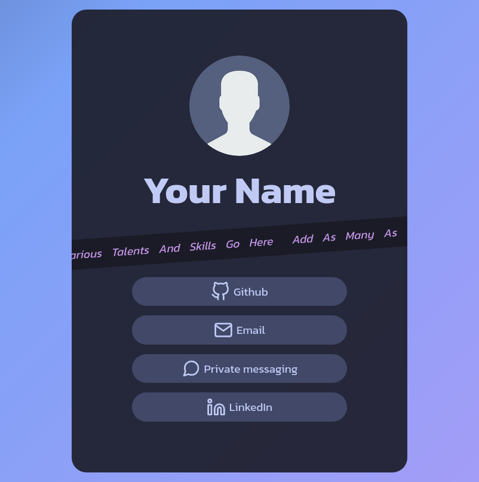

# Personal Minisite Template

See the live example: https://daqnal.github.io/personal-minisite-template/

## How to use

1. Clone or fork the repo
2. Delete **screenshot.png**
3. Replace /assets/me.webp with a circular cropped picture/logo of yourself
4. Things to change in **index.html**
    - Meta tag description
    - Site title
    - The **h1** element for your name
    - List your skills in the **li** elements **AND** duplicate them (the marquee effect won't work otherwise)
    - Change the buttons (which are actually anchor tags) to the social profiles that you want
        - If you change the social platform you'll need to download another icon to use
            - I recommend [Feather Icons](https://feathericons.com)
            - Put your icon in the assets folder to keep things organized
        - Don't forget to also change the href to the link to the social profile (use a mailto: tag for your email)
5. Customizing **styles.css**
    - Scroll to the section beginning with line 197 and fill out the content tags of each button to reflect the username/email/tag of the social profiles you link to
    - Read the comments in the CSS for further customization and explanation
6. Changing webcrawler options
    - If you want your site to be indexed on search engines, go to the **robots.txt** file in the root directory and change *disallow* to *allow*
    - If you don't want any crawlers on your site, leave your **robots.txt** as is
7. Deploy your site with a hosting platform like Github Pages, Vercel, or Cloudflare Pages. **Don't pay for hosting.** You are only hosting a static site, so these site offer hosting for free.

## Credits
- Font is Kanit by Google Fonts
- Icons from [Feather](https://feathericons.com)
- Colors taken from the [Tokyo Night theme](https://github.com/enkia/tokyo-night-vscode-theme)
- Background idea from [this codepen](https://codepen.io/P1N2O/pen/pyBNzX)
- Modern marquee effect from [this post](https://ryanmulligan.dev/blog/css-marquee/)
